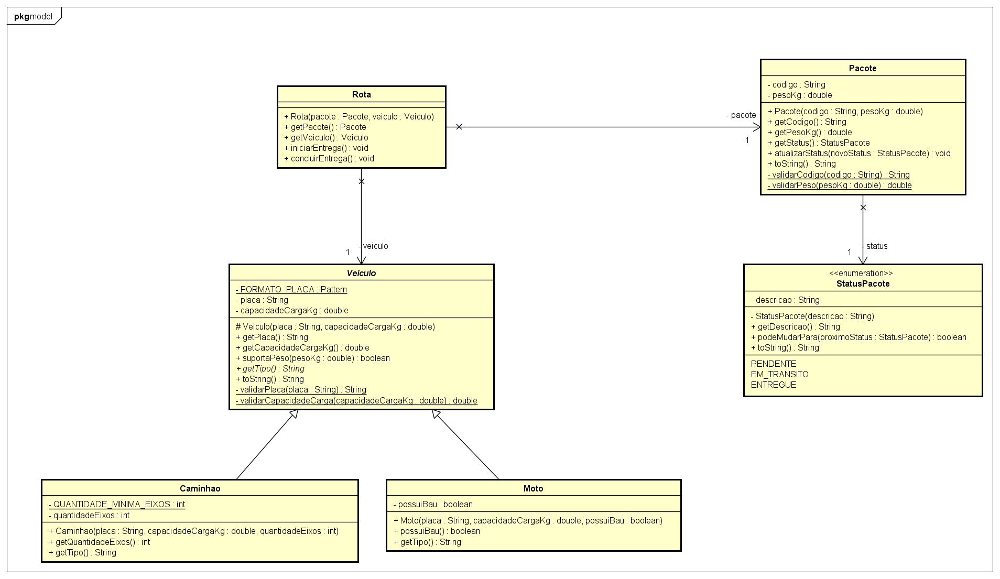

# FiapDelivery: Check Point 2 (POO)

Refatoração do código legado do **FiapDelivery**, o sistema de logística do FiapRide.
O código original compilava, mas tinha nomes sem sentido, dados expostos, código duplicado
e uma rota que só aceitava caminhão. Esta versão aplica encapsulamento, herança, associação,
construtores, documentação (Javadoc) e Clean Code.

## Diagrama de classes (Astah)



O projeto do Astah está em [`docs/FiapDelivery.asta`](docs/FiapDelivery.asta).

## Diagnóstico e refatoração

### 1. Nomes sem sentido → nomes que explicam a intenção

| Legado | Refatorado |
|---|---|
| `caminhao`, `moto`, `pacote` | `Caminhao`, `Moto`, `Pacote` (classes em PascalCase) |
| `pl` | `placa` |
| `cap` | `capacidadeCargaKg` (com a unidade no nome) |
| `eixos` | `quantidadeEixos` |
| `bau` | `possuiBau` |
| `cod`, `p`, `s` | `codigo`, `pesoKg`, `status` |
| `muda(String x)` | `atualizarStatus(StatusPacote novoStatus)` |
| `p1`, `c1` | `pacote`, `veiculo` |
| `vai()` | `iniciarEntrega()` e `concluirEntrega()` |

### 2. Dados expostos (`public`) → encapsulamento

- Todos os atributos são `private` e, quando não mudam, `final`.
- Os objetos são criados por **construtores com validação**: placa no padrão antigo ou Mercosul,
  capacidade e peso maiores que zero, caminhão com pelo menos 2 eixos.
  O `cap = -500.0` do legado agora é recusado com `IllegalArgumentException`.
- Não há setters. O status do pacote só muda por `atualizarStatus`, que segue o fluxo
  `PENDENTE → EM_TRANSITO → ENTREGUE` e não deixa pular nem voltar etapas.
- O status deixou de ser uma `String` livre (que aceitava qualquer texto) e virou o enum `StatusPacote`.

### 3. Código duplicado → herança

`placa` e `capacidade` estavam copiados em `caminhao` e `moto`. Agora ficam na classe abstrata
`Veiculo`, junto com a validação. `Caminhao` e `Moto` herdam dela e declaram só o que é
delas (`quantidadeEixos` e `possuiBau`).

### 4. Associação engessada → associação com a abstração

A `Rota` legada guardava um `caminhao`, então entregar de moto era impossível. A `Rota` nova
se associa a `Veiculo`: aceita `Caminhao`, `Moto` ou qualquer veículo criado no futuro sem
mudar nenhuma linha. Ela também confere se o veículo aguenta o peso do pacote antes de aceitar
a entrega.

## Estrutura

```
src/br/com/fiapdelivery
├── main
│   └── Principal.java        simulação das entregas
└── model
    ├── Veiculo.java          classe abstrata (placa, capacidade)
    ├── Caminhao.java         extends Veiculo
    ├── Moto.java             extends Veiculo
    ├── Pacote.java           código, peso e status
    ├── StatusPacote.java     enum com o fluxo da entrega
    └── Rota.java             associa um Pacote a um Veiculo
docs
├── FiapDelivery.asta         projeto do Astah
└── diagrama-de-classes.png   diagrama exportado
```

## Como executar

**Eclipse:** `File > Import > General > Existing Projects into Workspace`, selecione a pasta
do repositório e rode `br.com.fiapdelivery.main.Principal`.

**Terminal (Java 21+):**

```bash
javac -encoding UTF-8 -d bin $(find src -name "*.java")
java -cp bin br.com.fiapdelivery.main.Principal
```

Saída esperada:

```
=== Entregas ===
Levando pacote BR999 no veículo Caminhão ABC1234
Pacote BR999 entregue pelo veículo Caminhão ABC1234
Levando pacote BR1000 no veículo Moto BRA2E19
Situação atual: Pacote BR1000 (2.0 kg, Em trânsito)

=== Dados inválidos bloqueados ===
[BLOQUEADO] Caminhão com capacidade negativa -> A capacidade de carga deve ser maior que zero. Valor recebido: -500.0
[BLOQUEADO] Pacote mais pesado do que a moto suporta -> O veículo Moto BRA2E19 suporta até 25.0 kg e não pode levar o pacote BR2000 (80.0 kg).
[BLOQUEADO] Concluir entrega que nem começou -> O pacote BR3000 não pode passar de "Pendente" para "Entregue".
[BLOQUEADO] Voltar pacote entregue para pendente -> O pacote BR999 não pode passar de "Entregue" para "Pendente".
```
